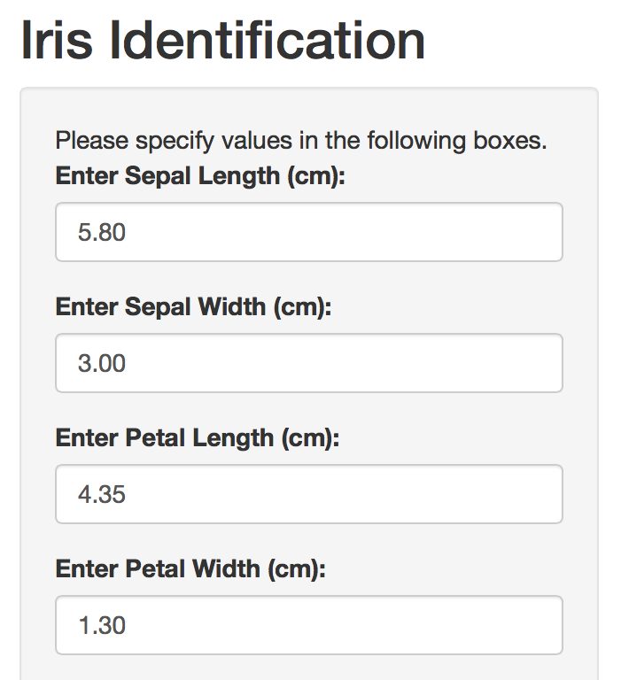

## Iris Dataset in R

Description

This data set contains 150 iris flowers' measurements in centimeters of sepal length, sepal width, petal length and petal width. 150 flowers belong to 3 species. They are iris setosa, iris versicolor and iris virginica. 

---

## Figure 1 Sepal Length vs Sepal Width

<iframe src="demo1.html" style="position:absolute;height:80%;width:90%"></iframe>

---

## Figure 2 Petal Length vs Petal Width

<iframe src="demo2.html" style="position:absolute;height:80%;width:90%"></iframe>

---
## Pre-filled Values
The pre-filled values are the median values for the corresponding characteristics and are served as references for users. 

---
## K Nearest Neighbors in Iris Identification Shiny App

1. Sepal length, sepal width, petal length and petal width are the characteristics used to predict unknown iris species. 

2. Euclidean distance is calculated to compare the closeness. 

3. Users have the flexibility to choose the parameter k which is the number of neighbors used to predict the unknown iris species. 

